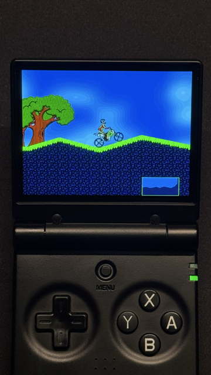

# Elasto Mania for Miyoo Mini (OnionOS / SpruceOS)

A port of [Elasto Mania](https://elastomania.com/) (the classic motorbike physics game) to the **Miyoo Mini Plus** handheld, supporting both **OnionOS** and **SpruceOS**.



## Quick Install — OnionOS

1. Download `elma-miyoo-v1.2.zip` from the [Releases](https://github.com/neri-rnd/elma-miyoo/releases) page
2. Extract the zip — it contains a `Roms/` folder
3. Copy the `Roms/` folder to the root of your OnionOS SD card (merge with existing)
4. **Copy game data files** from your Elasto Mania installation:
   - `elma.res` → `Roms/PORTS/Games/Elma/`
   - `Lgr/Default.lgr` → `Roms/PORTS/Games/Elma/lgr/default.lgr`
5. Launch from OnionOS: **Games → Shortcuts → Racing → Elma**

## Quick Install — SpruceOS

1. Download `elma-spruce-v1.2.zip` from the [Releases](https://github.com/neri-rnd/elma-miyoo/releases) page
2. Extract the zip — it contains a `Roms/` folder
3. Copy the `Roms/` folder to the root of your SpruceOS SD card (merge with existing)
4. **Copy game data files** from your Elasto Mania installation:
   - `elma.res` → `Roms/PORTS/Elma/`
   - `Lgr/Default.lgr` → `Roms/PORTS/Elma/lgr/default.lgr`
5. Launch from SpruceOS: **Ports → Elma**

> **SpruceOS note:** If the Ports menu doesn't appear, check `Emu/PORTS/config.json` on the SD card. If it has a `"devices"` key, remove that key entirely — it may whitelist specific devices and exclude your Miyoo Mini variant.

### Using Steam Elasto Mania Remastered Assets

If you own [Elasto Mania Remastered](https://store.steampowered.com/app/1290220/Elasto_Mania_Remastered/) on Steam, you can use its assets:

1. Copy `elma.res` from the Steam installation → the appropriate `Elma/` folder for your OS
2. For graphics: copy **`orig.lgr`** (not `default.lgr`) from the Steam `Lgr/` folder → rename it to `default.lgr` on the SD card

> **Why `orig.lgr`?** Steam's `default.lgr` is a hi-res Remastered format (LGR13) that works but uses upscaled assets. `orig.lgr` contains the classic-style graphics which look better on the Miyoo's 640x480 screen.

### SD Card Layout — OnionOS

```
SD root/
└── Roms/
    └── PORTS/
        ├── Games/
        │   └── Elma/
        │       ├── elma              (game binary)
        │       ├── elma.res          ← you provide this
        │       ├── config.json
        │       ├── launch.sh
        │       ├── lev/              (level packs)
        │       ├── lgr/
        │       │   └── default.lgr   ← you provide this
        │       ├── libs/             (SDL2 + runtime libs)
        │       └── rec/              (replay files)
        ├── Imgs/
        │   └── Elma.png
        └── Shortcuts/
            └── Racing/
                └── Elma.notfound
```

### SD Card Layout — SpruceOS

```
SD root/
└── Roms/
    └── PORTS/
        ├── Elma/
        │   ├── elma              (game binary)
        │   ├── elma.res          ← you provide this
        │   ├── launch.sh
        │   ├── lev/              (level packs)
        │   ├── lgr/
        │   │   └── default.lgr   ← you provide this
        │   ├── libs/             (SDL2 + runtime libs)
        │   └── rec/              (replay files)
        ├── Elma.sh               (menu entry script)
        └── Imgs/
            └── Elma.png
```

## Controls

| Button | In-Game | Menu |
|--------|---------|------|
| D-pad Up | Gas / Throttle | Navigate up |
| D-pad Down | Brake | Navigate down |
| D-pad Left | Rotate left | — |
| D-pad Right | Rotate right | — |
| A | Turn (change direction) | Confirm |
| B | — | Back / Cancel |
| L | — | Page up |
| R | — | Page down |
| Start | — | Confirm |
| Menu | — | Quit to OS |

Controls are customizable in-game via **Options → Customize controls**.

### Recommended Settings

Go to **Options** after first launch:

- **Video detail** → Low (less distraction)
- **Centered camera** → Yes
- **Customize controls** → set **Brake Alias** to **B**, **Alovolt** to **Y**

## Building from Source

### Prerequisites

- Docker (for cross-compilation)
- [parasyte SDL2 fork](https://github.com/parasyte/sdl2-miyern) — keyboard-input SDL2 for OnionOS ports

### Build

```bash
# Build the Docker cross-compilation environment
docker build -t elma-miyoo-build .

# Compile for Miyoo Mini
docker run --rm -v $(pwd):/work -v $(pwd)/../sdl2:/work/sdl2 \
  elma-miyoo-build make -C /work TARGET=miyoo -j$(nproc)

# Strip and copy binary to deploy directories
make TARGET=miyoo package          # OnionOS
make TARGET=miyoo package-spruce   # SpruceOS
```

Release zips can then be built from the deploy directories:

```bash
cd deploy && zip -r ../elma-miyoo-v1.2.zip Roms/
cd deploy-spruce && zip -r ../elma-spruce-v1.2.zip Roms/
```

### Native Build (macOS, for development)

```bash
brew install sdl2
make            # builds to build/elma
```

## Project Structure

```
├── src/              C++ source (ported from elma-classic)
├── include/          Headers
├── deploy/           OnionOS deployment layout (mirrors SD card)
├── deploy-spruce/    SpruceOS deployment layout (mirrors SD card)
├── docs/             Screenshots
├── Dockerfile        ARM cross-compilation environment
└── Makefile          Build system (native + Miyoo targets)
```

## Acknowledgments

- **Elasto Mania** by Balazs Rozsa — the original game
- [elma-classic](https://github.com/nicq/elma-classic) — open-source C++ reimplementation this port is based on
- [steward-fu SDL2](https://github.com/nicq/elma-classic) — Miyoo Mini SDL2 port with hardware rendering
- [parasyte SDL2 fork](https://github.com/parasyte/sdl2-miyern) — keyboard-input SDL2 for OnionOS ports
- [OnionOS](https://github.com/OnionUI/Onion) — custom firmware for Miyoo Mini
- [SpruceOS](https://github.com/spruceUI/spruceOS) — alternative custom firmware for Miyoo Mini
